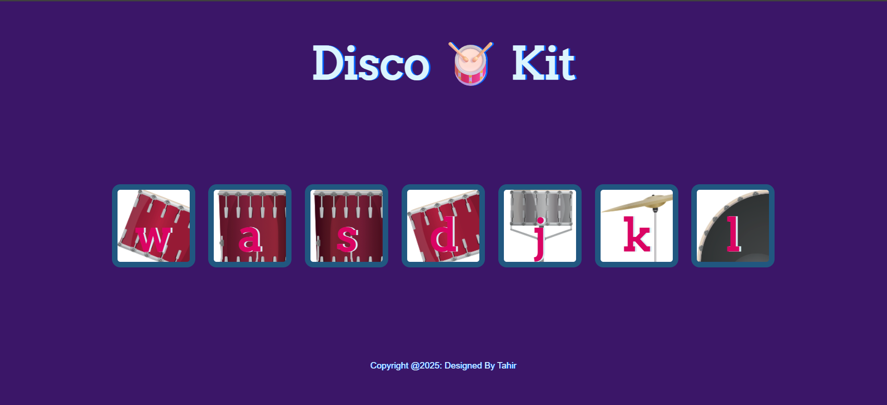

🥁 Disco Kit

An interactive virtual drum kit built using HTML, CSS, and JavaScript.
Press the keys on your keyboard or click the drums to play unique sounds and create your own rhythm 🎶.

✨ Features

🎼 Play different drum sounds with keyboard keys (W, A, S, D, J, K, L)

🖱️ Clickable drum buttons for instant sound

🌈 Attractive UI with a disco vibe

⚡ Lightweight and responsive

📸 Screenshots
Drum Kit 

🚀 How to Run

1. Clone the repository
    git clone https://github.com/Tahirrr-04/Disco_Kit.git
2. Navigate to the project folder
    cd disco-kit
3. Open index.html in your browser.

